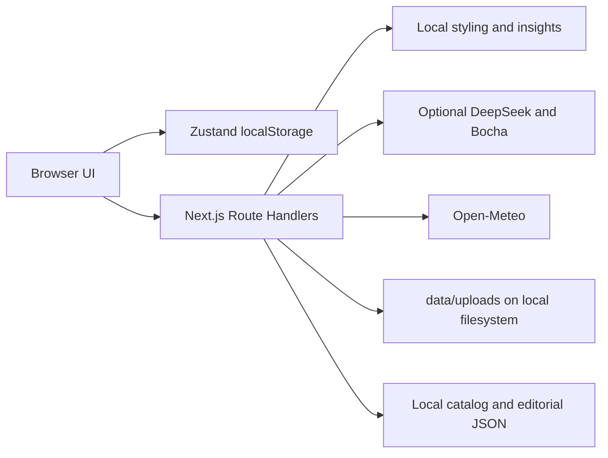

# Architecture and evidence

## Data flow

The browser persists wardrobe records, preferences, saved looks and wear history. Route Handlers validate requests and either call local logic or external providers. The UI labels the result as live, local, curated or fallback, so the data source is visible.

Key implementation locations: `lib/store.ts` (persisted state), `lib/stylist-local.ts` (local matching), `lib/insights.ts` (wardrobe analysis), `services/ai/stylist.ts` (AI service), `services/weather/weatherProvider.ts` (weather), `app/api/` (HTTP endpoints), and `components/views/` (product screens).

## Engineering decisions

- **Graceful degradation:** missing or failing API keys do not block local styling. Weather failures retain an explicit fallback state.
- **Data provenance:** editorial and product content carry source links; a curated item is not represented as a fresh search result.
- **Private local records:** a visitor's wardrobe state is held in that visitor's browser. Local photo uploads are excluded from Git.
- **Upload and image handling:** the app compresses user photos client-side before sending them to its upload route and validates public image URLs before proxying external images.
- **Verification:** Node tests cover weather and image handling, while lint, typecheck and production build check the application. `.github/workflows/ci.yml` runs these commands on GitHub.

## Current limits and next research questions

- `localStorage` gives no account, sharing, recovery or cross-device sync. A future version would need authentication, a database, migration and export/delete controls.
- Local server file uploads will not survive ephemeral hosting. A production service would need managed object storage and access controls.
- The recommendation rules are an interpretable prototype. They have not been evaluated against a labelled outfit dataset or a user study; satisfaction and fairness claims would require that evidence.
- External services, retailer inventory and editorial feeds may fail or change. Snapshot data can become stale.
- Third-party editorial photography and catalog snapshots require a rights review before broad public distribution.
